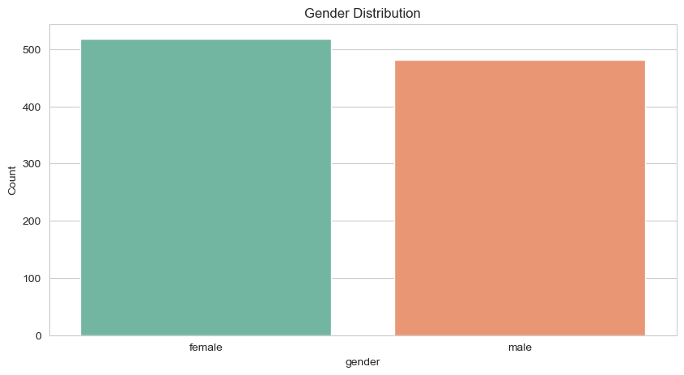
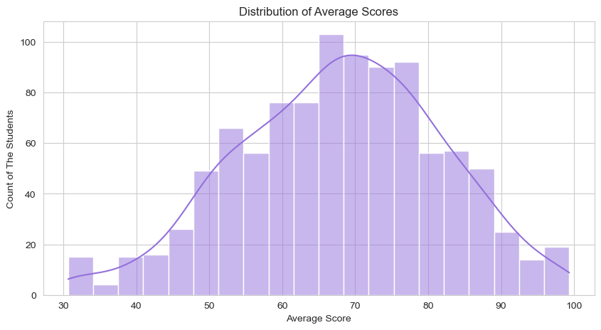
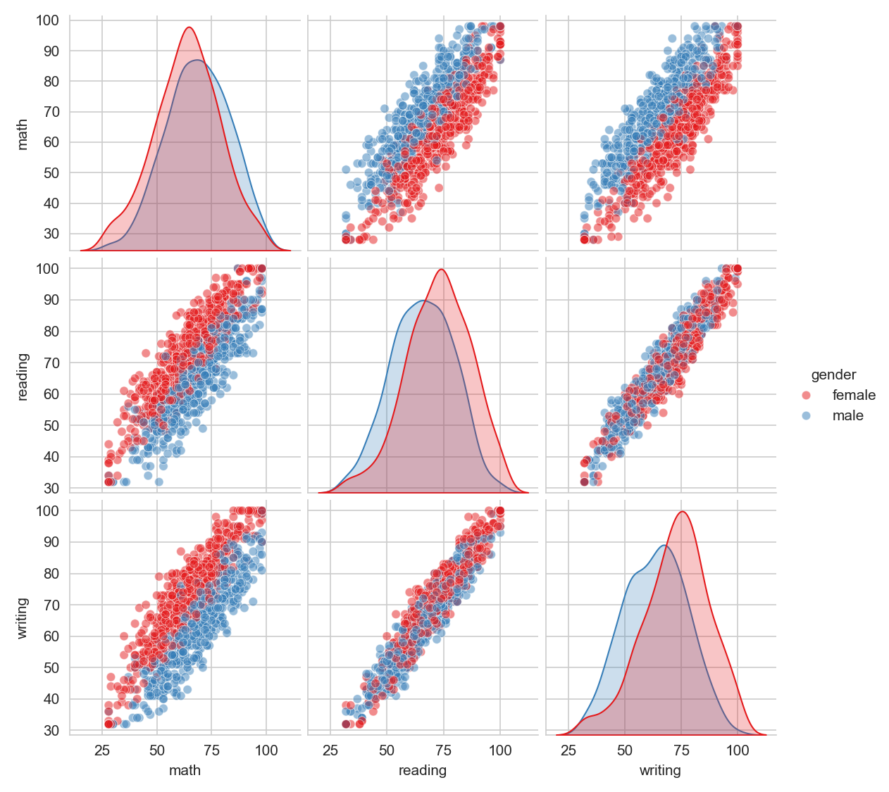

# Student Performance in Exams - Exploratory Data Analysis (EDA)

An end-to-end Exploratory Data Analysis (EDA) project analyzing academic exam scores of 1,000 high school students. This project investigates how demographic, socio-economic, and educational background factors (gender, lunch type, test preparation course, parental education, and ethnicity) impact performance across Math, Reading, and Writing.

---

## 1. Project Overview & Objectives

Academic performance is shaped by various external and individual factors. The objective of this analysis is to determine which factors create significant score disparities, identify at-risk student cohorts, and propose data-backed interventions for educators and school administrations.

### Key Objectives:
- Identify the primary drivers of student score variations.
- Quantify score differences across lunch types, test preparation status, and parental education levels.
- Analyze correlation between individual subjects (Math, Reading, Writing).
- Profile the highest-performing student cohort vs. the most at-risk cohort.
- Provide practical, structured recommendations to improve overall student outcomes.

---

## 2. Dataset Description

The dataset consists of **1,000 student records** with 8 original attributes, plus engineered features created during analysis.

| Column Name | Data Type | Description |
|---|---|---|
| `gender` | Categorical | Student gender (`female`, `male`) |
| `race/ethnicity` | Categorical | Anonymized ethnic group (`group A` through `group E`) |
| `parental level of education` | Categorical | Parent's highest education (`some high school` to `master's degree`) |
| `lunch` | Categorical | Lunch type: `standard` or `free/reduced` (proxy for socio-economic status) |
| `test preparation course` | Categorical | Status: `completed` or `none` |
| `math score` | Integer | Math test score (0 - 100) |
| `reading score` | Integer | Reading test score (0 - 100) |
| `writing score` | Integer | Writing test score (0 - 100) |
| `total` | Integer | Combined score across all 3 subjects (out of 300) *(Engineered)* |
| `average` | Float | Mean score across all 3 subjects (0.0 - 100.0) *(Engineered)* |
| `grade` | Categorical | Letter grade based on average score (A, B, C, D, F) *(Engineered)* |

**Dataset Source:** [Kaggle - Students Performance in Exams](https://www.kaggle.com/datasets/spscientist/students-performance-in-exams)

---

## 3. Project Workflow & Steps Performed

```
Raw Data (data/) --> Data Inspection & Cleaning --> Feature Engineering --> Univariate Analysis --> Bivariate & Correlation Analysis --> Cohort Profiling --> Recommendations
```

### Summary of What Was Done:
1. **Data Inspection & Cleaning:**
   - Checked for missing values: Verified 0 null values across all columns.
   - Checked for duplicate entries: 0 duplicate rows found.
   - Checked summary statistics and value distributions.
2. **Feature Engineering:**
   - Created `total`: Sum of `math`, `reading`, and `writing` scores.
   - Created `average`: Mean score across the 3 subjects.
   - Created `grade`: Assigned letter grades based on standard grading thresholds (A: 80+, B: 70-79, C: 60-69, D: 50-59, F: <50).
   - Created `percentile_groups` to evaluate high vs. low performance tiers.
3. **Univariate Analysis:**
   - Visualized distributions of individual subject scores and overall average scores.
   - Evaluated demographic distributions (gender balance, lunch type proportions, ethnicity breakdown).
4. **Bivariate Analysis:**
   - Examined the impact of test preparation on student average scores.
   - Compared performance between standard lunch vs. free/reduced lunch students.
   - Analyzed the relationship between parental education and student achievement.
   - Assessed score differences across ethnic groups.
5. **Multivariate & Correlation Analysis:**
   - Computed Pearson correlation matrix across Math, Reading, and Writing.
   - Evaluated intersectional factors (e.g., parental education + lunch type interaction).
6. **Cohort Profiling:**
   - Segmented Top 10% performers vs. Bottom 10% at-risk students to determine key differentiators.

---

## 4. Key Insights & Visual Findings

### 1. Lunch Type is the Single Strongest Performance Factor
- Students with **standard lunch** score **~11 points higher** on average compared to students with **free/reduced lunch**.
- The free/reduced lunch group has the highest concentration of low scores and failing grades.
- **Key Takeaway:** Nutrition and socio-economic support are the strongest single determinants of student test performance in this dataset.

---

### 2. Test Preparation Course Adds ~10 Points
- Students who completed the test preparation course scored **~10 points higher** on average across all subjects compared to those who did not.
- This improvement is consistent across all ethnic groups and socio-economic backgrounds.
- Female students showed an even higher average score boost from completing test preparation.

---

### 3. Gender Differences by Subject
- **Female students** significantly outperform male students in **Reading and Writing**.
- The largest gender gap occurs in **Writing**, where female students lead by ~5 points.
- **Male students** lead only in **Math**.



---

### 4. Parental Education Directly Influences Student Scores
- A consistent upward trend exists between parent education level and student average scores:
  - **Master's degree parents:** Top average score across all student groups (~73.6).
  - **Bachelor's degree parents:** Second highest (~71.9).
  - **High school / Some high school:** Lowest average scores (~63.0 - 65.1).
- Higher parental education provides academic support, resources, and learning environments at home that directly reflect in exam performance.

---

### 5. Subject Correlations: Reading and Writing are Almost Identical (r = 0.95)
- **Reading and Writing:** Correlation of **0.95** (strongest link in the entire dataset).
- **Math and Reading:** Correlation of **0.81**.
- **Math and Writing:** Correlation of **0.80**.
- **Key Takeaway:** Subject performance is highly interconnected. Students struggling in Math also tend to have lower Reading/Writing scores, meaning academic struggles are rarely isolated to a single subject.


---

### 6. Overall Average Score Distribution
- The average score follows a clean bell-shaped normal distribution centered around **68 points**.
- Most students pass their exams, but a distinct tail of low scorers requires structured intervention.



---

### 7. Multivariate Analysis Across Subjects & Demographics
- Pairwise comparisons show clear clustering and linear relationships among test scores, separated by gender.



---

### 8. Best-Performing vs. Most At-Risk Student Cohorts

| Cohort | Defining Characteristics | Average Performance |
|---|---|---|
| **Top 10% Students** | Female + Standard Lunch + Completed Test Prep + Educated Parents | Highest average score in the dataset (85 - 100). |
| **Bottom 10% Students (At-Risk)** | Free/Reduced Lunch + No Test Prep + Parents with High School Education | Lowest average score (< 50). Highest rate of course failure. |

---

## 5. Actionable Recommendations

| # | Strategic Recommendation | Target Group | Justification | Expected Business / Academic Impact |
|---|---|---|---|---|
| **1** | **Universalize Meal & Nutritional Support** | Free/Reduced lunch students | 11-point score disparity exists between lunch types. | Closes the socio-economic score gap and improves student focus. |
| **2** | **Institutionalize Mandatory / Free Test Prep** | Students with `none` for test prep | Prep completion delivers an immediate ~10 point increase across all groups. | Raises the overall grade threshold and boosts pass rates. |
| **3** | **Targeted Subject Workshops by Gender** | Females (Math) & Males (Writing) | Females trail in math, while males trail significantly in writing (~5 pts). | Balances subject competencies across gender cohorts. |
| **4** | **First-Generation Parental Engagement Programs** | Students of parents with High School education | Lower parental education consistently correlates with lower test scores. | Provides extra academic guidance outside the home. |
| **5** | **Early Warning System for At-Risk Students** | Bottom 10% profiling cohort | Students with free lunch + no test prep are at high risk of course failure. | Enables early tutoring and counseling before exams. |

---

## 6. Interview Quick Revision Cheat-Sheet

If asked about this project during an interview, recall these core points:
- **Dataset Size:** 1,000 student records with 8 original features + 3 engineered features (`total`, `average`, `grade`).
- **Data Quality:** Clean dataset with 0 missing values and 0 duplicate rows.
- **Top Predictor:** Lunch type (Standard lunch students score **11 points higher**; proxy for socio-economic background).
- **Test Preparation:** Boosts average scores by **~10 points** across all groups.
- **Gender Dynamics:** Females lead in Reading and Writing (especially Writing by ~5 pts); Males lead in Math.
- **Strongest Correlation:** Reading and Writing have an **r = 0.95** correlation.
- **Parental Impact:** Linear relationship (Master's degree parents = highest scores; High School parents = lowest).
- **Most At-Risk Cohort:** Free lunch + No test prep + High school educated parents.

---

## 7. Repository Structure

```
STUDENT_Performance/
├── data/
│   └── StudentsPerformance.csv          # Raw Kaggle dataset
├── images/
│   ├── maths_score_vs_readingscore.png  # Correlation scatterplot
│   ├── pairplot.png                     # Multi-subject pairplot by gender
│   ├── univariate_average_score.png     # Average score distribution histogram
│   └── univariate_gender.png            # Gender distribution bar chart
├── notebooks/
│   └── student_performance_analysis.ipynb # Complete EDA, visualization & analysis notebook
└── readme.md                            # Comprehensive project documentation
```

---

## 8. Tools Used

- **Python:** Core programming language.
- **Pandas & NumPy:** Data cleaning, manipulation, and feature engineering.
- **Matplotlib & Seaborn:** Data visualization, distributions, and correlation heatmaps.
- **Jupyter Notebook:** Interactive analysis environment.

---

## 9. Author

**Deepanshu Kapri**
