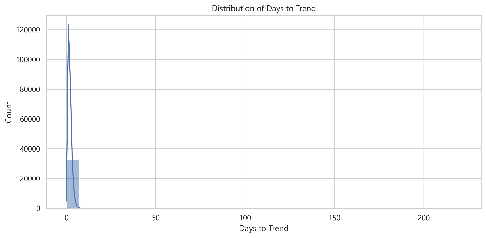
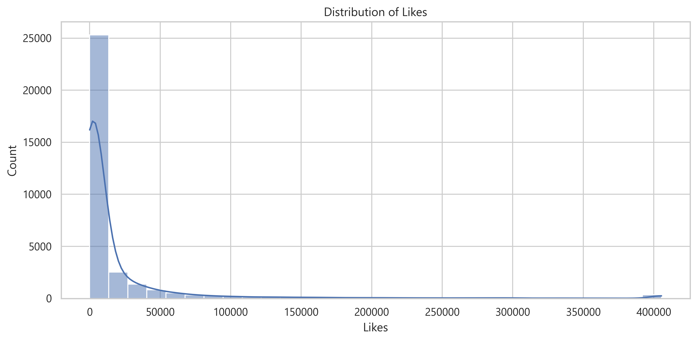
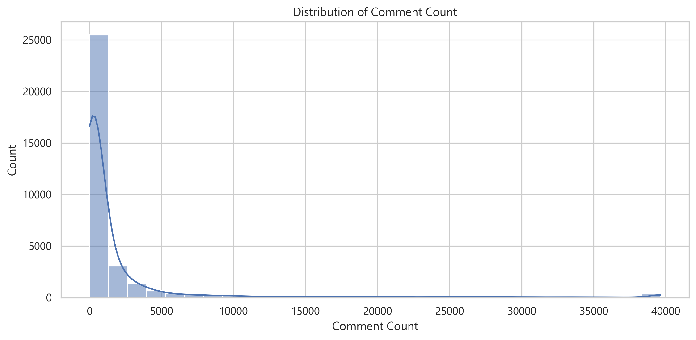
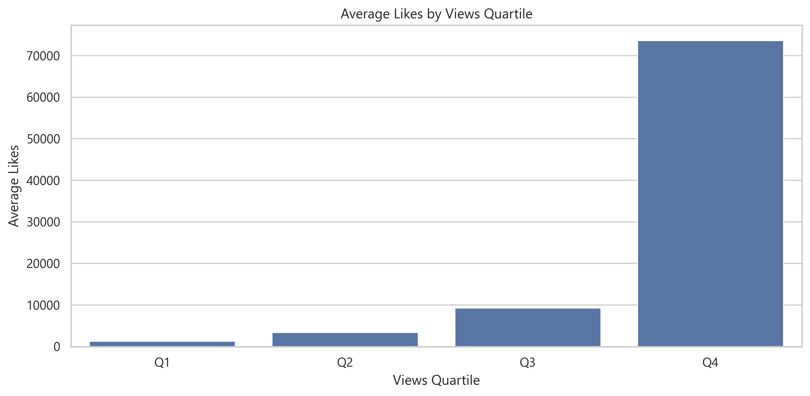
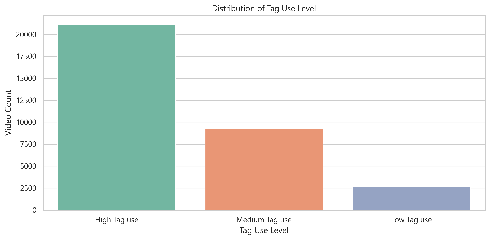
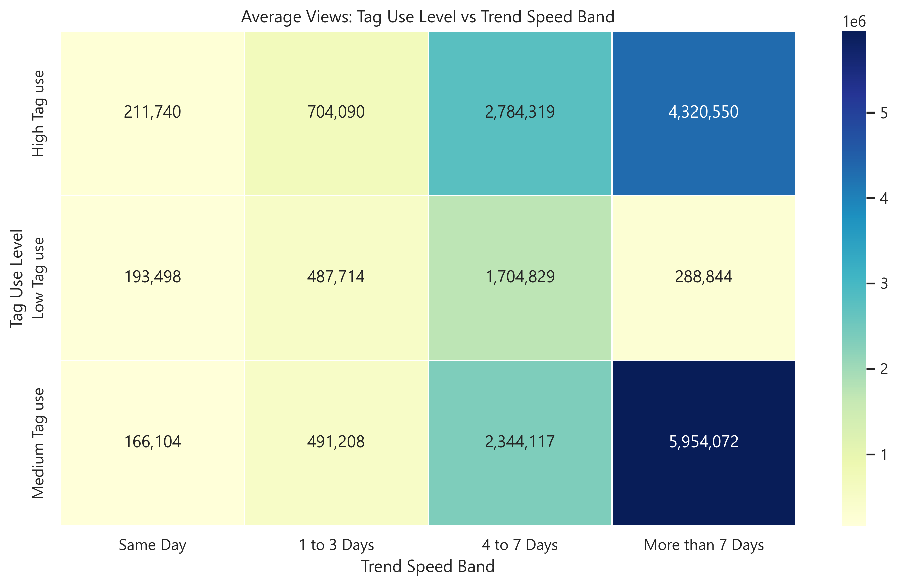
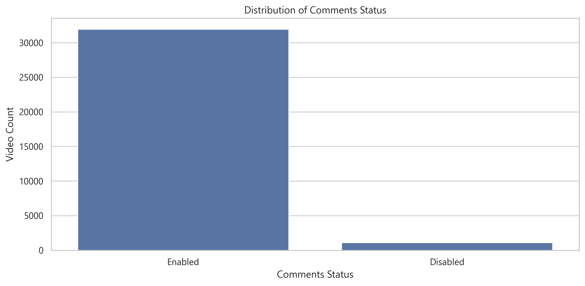
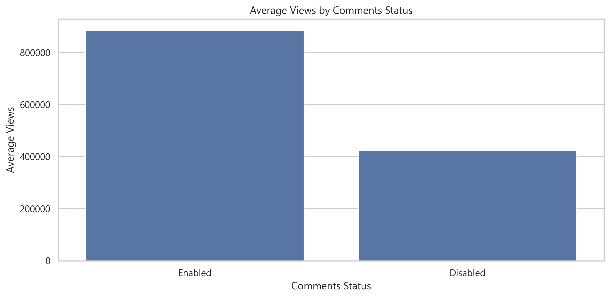

# YouTube India Trending Videos - Exploratory Data Analysis (EDA)

An end-to-end Data Analytics project examining 33,089 trending YouTube videos in India to identify what drives virality, how quickly videos hit trending, the best days to publish, and how engagement metrics scale with reach.

---

## 1. Project Overview

YouTube's trending tab represents the small fraction of videos that capture massive audience attention in a specific market. In this project, I analyzed the Kaggle YouTube India dataset to look at the mechanics behind trending videos - analyzing upload timing, trending speed, engagement rates (likes, comments, views), and metadata practices like tag density.

The goal was to move past subjective opinions and provide concrete, data-backed insights for digital creators, media channels, and brand marketing teams looking to optimize their publishing strategy.

---

## 2. Key Questions This Project Answers

- **How fast do videos trend?** What is the critical window after upload where a video has a chance of trending?
- **Which days are best for publishing?** Do specific weekdays produce more trending videos and higher average views?
- **How does engagement scale with views?** How strongly do likes and comments correlate with total view count?
- **Does metadata (tags and descriptions) matter?** Do trending videos use heavy tags, and does having a description impact performance?
- **What distinguishes top-tier viral videos?** How do Q4 (top quartile) videos differ from average trending uploads?

---

## 3. Dataset & Complete Feature Dictionary

The raw dataset contained 37,352 records. After cleaning and removing 4,263 duplicate entries, the final working dataset contains **33,089 unique trending records** across 29 features (14 original attributes + 15 engineered variables).

| Column Name | Data Type | Origin | Description & How It Was Created |
|---|---|---|---|
| `video_id` | Text | Original | Unique YouTube video identifier |
| `trending_date` | Datetime | Original | Date the video appeared on the trending page (converted from text to datetime) |
| `title` | Text | Original | Video title |
| `channel_title` | Text | Original | Name of the YouTube channel |
| `category_id` | Integer | Original | Numeric identifier for video category |
| `publish_time` | Datetime | Original | Exact UTC timestamp of video upload |
| `tags` | Text | Original | Pipe-separated tags used by the creator (e.g. `music|pop|india`) |
| `views` | Numeric | Original / Capped | View count (capped at 99th percentile: 1.28 Crore to handle outliers) |
| `likes` | Numeric | Original / Capped | Like count (capped at 99th percentile: 4.23 Lakhs) |
| `dislikes` | Numeric | Original / Capped | Dislike count |
| `comment_count` | Numeric | Original / Capped | Total comments count |
| `comments_disabled` | Boolean | Original | True if creator turned off comments, False if allowed |
| `ratings_disabled` | Boolean | Original | True if likes/dislikes are hidden, False if visible |
| `description` | Text | Original | Video description text (missing values filled with 'No description') |
| `has_description` | Binary | Engineered | `1` if description exists, `0` if empty (created using `np.where`) |
| `publish_date` | Datetime | Engineered | Normalized upload date with time portion removed (`.dt.normalize()`) |
| `publish_hour` | Integer | Engineered | Hour of upload (0 to 23) extracted from publish time |
| `publish_weekday` | Categorical | Engineered | Day of the week the video was uploaded (Monday to Sunday) |
| `days_to_trend` | Integer | Engineered | Days taken to hit trending (`trending_date - publish_date`) |
| `trend_speed_band` | Categorical | Engineered | Binned speed tier (`Same Day`, `1 to 3 Days`, `4 to 7 Days`, `More than 7 Days`) using `pd.cut()` |
| `tag_count` | Integer | Engineered | Total number of tags calculated by counting pipe separators (`|`) |
| `tag_use_level` | Categorical | Engineered | Tag density tier: `No Tags` (0), `Low` (1-5), `Medium` (6-15), `High` (16+) |
| `views_quartile` | Categorical | Engineered | 4 equal-sized view groups (`Q1`, `Q2`, `Q3`, `Q4`) created using `pd.qcut()` |
| `like_rate` | Float | Engineered | Likes divided by views ratio (`likes / views`) |
| `comment_rate` | Float | Engineered | Comments divided by views ratio (`comment_count / views`) |
| `title_length` | Integer | Engineered | Character count of the video title (`title.str.len()`) |
| `description_length` | Integer | Engineered | Character count of the description (`description.str.len()`) |
| `comments_status` | Categorical | Engineered | 'Enabled' vs 'Disabled' text label for clear plotting |
| `ratings_status` | Categorical | Engineered | 'Enabled' vs 'Disabled' text label for like visibility |

**Data Source:** [Kaggle - YouTube Trending Video Dataset](https://www.kaggle.com/datasets/datasnaek/youtube-new)

---

## 4. What Was Done in This Project (Step-by-Step)

1. **Data Inspection & Quality Checks:**
   - Loaded dataset and standardized column names to lowercase snake_case.
   - Identified 4,263 duplicate records and 561 missing descriptions.
2. **Deduplication & Data Cleaning:**
   - Dropped all 4,263 exact duplicate rows, reducing records from 37,352 to **33,089 clean rows**.
   - Converted date strings (`trending_date` and `publish_time`) into proper `datetime64` format.
   - Filled missing descriptions with 'No description' and created `has_description` flag.
3. **Outlier Treatment (99th Percentile Capping):**
   - Viral videos with over 12 Crore views create extreme skew and flatten standard charts.
   - Calculated the 99th percentile cutoff for views (1.28 Crore), likes (4.23 Lakhs), and comments.
   - Applied `.clip(upper=limit)` so extreme values are capped at the 99% mark without deleting any rows.
4. **Feature Engineering (15 Derived Features):**
   - Calculated `days_to_trend` by subtracting upload date from trending date.
   - Binned trending velocity into 4 fixed bands using `pd.cut()` (`Same Day`, `1 to 3 Days`, `4 to 7 Days`, `7+ Days`).
   - Divided views into 4 equal quartiles using `pd.qcut()` (Q1 to Q4, each containing 25% of data).
   - Built custom tag parsing function to split pipe strings and classify tag density (`No Tags`, `Low`, `Medium`, `High`).
   - Calculated engagement conversion rates (`like_rate` and `comment_rate`).
   - Extracted text length features (`title_length`, `description_length`).
5. **Univariate Analysis:**
   - Plotted individual distributions for views, likes, comments, days to trend, weekdays, tag usage, and engagement rates.
6. **Bivariate Analysis:**
   - Evaluated views across upload weekdays, likes across view quartiles, and views across trending speed tiers.
   - Tested whether disabling comments or ratings hurts video reach.
7. **Multivariate Analysis:**
   - Computed Pearson correlation matrix across engagement metrics.
   - Generated pivot heatmap comparing average views across tag density vs. trending speed.
   - Generated multi-metric pairplot to observe simultaneous engagement scaling.

---

## 5. Detailed Visual Insights & Findings

### 1. Trending Velocity: The 72-Hour Golden Window
- **86.2% of videos (28,515 records)** hit the trending page within **1 to 3 days** of upload.
- **Median time to trend is 2 days**.
- Only **1.3% (441 videos)** trend on the same day as upload, and only **0.2% (64 videos)** take longer than 7 days.
- **Key Takeaway:** Virality in India is heavily front-loaded. If a video does not gain momentum within the first 48 to 72 hours, its chance of ever reaching the trending page drops to almost zero.





---

### 2. Best Days to Publish: Thursday to Saturday Spike
- **Friday** is the #1 day for published trending videos (**5,573 videos**), followed closely by **Saturday** (**5,196**) and **Thursday** (**4,986**).
- **Sunday** produces the fewest trending uploads (**3,558 videos**).
- Videos uploaded on Thursday and Friday also generate the highest average views, capitalizing on weekend leisure viewing habits in India.





---

### 3. View Counts: High Positive Skew (Median vs. Mean)
- **Median views:** **2.75 Lakhs (275,027)**.
- **Mean views:** **8.83 Lakhs** (pulled up by multi-million mega-hits).
- 99% of videos have views below 1.28 Crore (max raw value reached 12.54 Crore).
- Top quartile (**Q4**) videos average over **2.83M views**, representing about 44.6x the average view count of Q1 videos (63.49K).



---

### 4. Audience Engagement: Likes & Comments Distribution
- **Median Likes:** **2,757** (75% of videos have 12,011 likes or fewer).
- **Median Comments:** **298** (75% of videos have 1,169 comments or fewer).
- **Median Like Rate:** **0.94%** (~1 like per 100 views).
- **Median Comment Rate:** **0.10%** (~1 comment per 1,000 views).
- As videos move from Q1 to Q4 views, average likes jump by over **28x**, showing that reach and positive engagement scale together.







---

### 5. Correlation Heatmap: What the Metrics Show
- **Likes and Comments (r = 0.92):** This is the strongest correlation in the entire dataset. Viewers who take the time to comment are almost always active likers.
- **Likes and Views (r = 0.82):** Strong positive correlation - higher reach consistently generates higher likes.
- **Comments and Views (r = 0.74):** Solid linear relationship, confirming that active discussions track with overall visibility.
- **Key Takeaway:** Prompting viewers to comment (via questions or pinned comments) is the single most effective way to stimulate overall engagement signals.



---

### 6. Multi-Metric Pairplot: Engagement Scaling
- The pairplot displays linear and power-law relationships across views, likes, and comment counts.
- The scatter points show that once a video crosses ~10 Lakh views, comment volume experiences a sharp upward inflection.



---

### 7. Tag Usage Level: Heavy Tagging Dominates
- **63.8% of trending videos (21,120)** use **High Tag counts** (16+ tags).
- **28.0% (9,252)** use **Medium Tag counts** (6 to 15 tags).
- Less than **8.2%** of trending videos had low or no tags.
- **Key Takeaway:** While audience watch time drives retention, comprehensive keyword metadata remains a universal practice among successful trending channels in India.





---

### 8. Comments & Ratings Visibility
- Over **97.4%** of trending videos keep comments enabled.
- Videos with comments enabled generate substantially higher average views compared to videos with comments disabled.
- Disabling comments cuts off key interaction signals needed by the recommendation algorithm.





---

## 6. Project Takeaways at a Glance

When explaining or revising this project, these are the core numbers and conclusions to highlight:

- **Clean Dataset Size:** 33,089 trending videos across 29 features (after removing 4,263 duplicates).
- **Velocity Window:** **86.2% of videos trend within 1 to 3 days** (median = 2 days). The first 72 hours decide trending success.
- **Best Upload Timing:** **Thursday, Friday, Saturday** produce 47.7% of all trending videos and the highest average views.
- **Benchmark Numbers:**
  - Median Views: **2.75 Lakhs**
  - Median Likes: **2,757**
  - Median Comments: **298**
- **Engagement Conversion:** Median like rate is **0.94%** (1 like per 100 views); median comment rate is **0.10%** (1 comment per 1,000 views).
- **Highest Correlation:** Likes and Comments have an **r = 0.92** link.
- **Tag Importance:** Over **91.8%** of trending videos utilize medium to heavy tag counts.

---

## 7. Actionable Recommendations for Content Creators & Brands

| # | Strategic Recommendation | Target Action | Evidence / Data Backing | Expected Impact |
|---|---|---|---|---|
| **1** | **Focus on the 72-Hour Push** | Community posts, external social shares, notifications | 86.2% of videos trend within 1 to 3 days. | Maximizes momentum during the algorithm's critical evaluation window. |
| **2** | **Publish on Thursday or Friday Afternoons** | Upload calendar scheduling | Highest trending volume (5.5k on Friday) and highest average views. | Captures prime weekend leisure viewing traffic. |
| **3** | **Actively Drive Comment Prompts** | Ask questions in video, pin discussion comments | Likes and comments have an r = 0.92 correlation. | Higher comment activity boosts algorithmic recommendation signals. |
| **4** | **Maintain Comprehensive Tagging (15+ Tags)** | Video SEO & metadata setup | 91.8% of trending videos use Medium to High tag counts. | Maximizes discoverability across search and related video rails. |
| **5** | **Never Disable Comments or Ratings** | Video settings | Over 97% of trending videos have comments enabled and receive higher views. | Preserves the core engagement signals required to trend. |

---

## 8. Repository Structure

```
YOUTUBE_TREND_ANALYSIS/
|-- data/
|   \-- youtube_india_cleaned.csv            # Cleaned & processed dataset (33,089 rows, 29 cols)
|-- images/
|   |-- comment_count_distribution.png       # Comments distribution histogram
|   |-- comments_status_distribution.png     # Comments enabled vs disabled countplot
|   |-- correlation_heatmap.png              # Correlation heatmap of views, likes, comments
|   |-- days_to_trend_distribution.png       # Histogram of days to trend
|   |-- like_rate_distribution.png           # Like rate distribution histogram
|   |-- likes_by_views_quartile.png          # Boxplot of likes across views quartiles
|   |-- likes_distribution.png               # Likes distribution histogram
|   |-- pairplot.png                         # Multi-metric pairplot
|   |-- pivot_heatmap.png                    # Pivot heatmap: Views by tags & speed band
|   |-- publish_weekday_distribution.png     # Upload day distribution countplot
|   |-- ratings_status_distribution.png      # Ratings enabled vs disabled countplot
|   |-- tag_use_level_distribution.png       # Tag use tiers countplot
|   |-- trend_speed_distribution.png         # Trending velocity speed band distribution
|   |-- views_by_comments_status.png         # Views comparison by comments status
|   |-- views_by_trend_speed.png             # Average views by trend speed barplot
|   |-- views_by_weekday.png                 # Average views by publish day barplot
|   \-- views_distribution.png               # Views distribution histogram
|-- notebooks/
|   \-- youtube_trend_analysis.ipynb         # Complete analysis & visualization notebook
|-- requirements.txt                         # Python dependencies
\-- README.md                                # Comprehensive project documentation
```

---

## 9. Tools Used

- **Python** (Pandas, NumPy) - Data loading, cleaning, datetime parsing, and feature engineering
- **Matplotlib & Seaborn** - Data visualizations, distribution plots, boxplots, heatmaps, and pairplots
- **Jupyter Notebook** - Interactive exploratory data analysis environment

---

## 10. Author

**Deepanshu Kapri**
