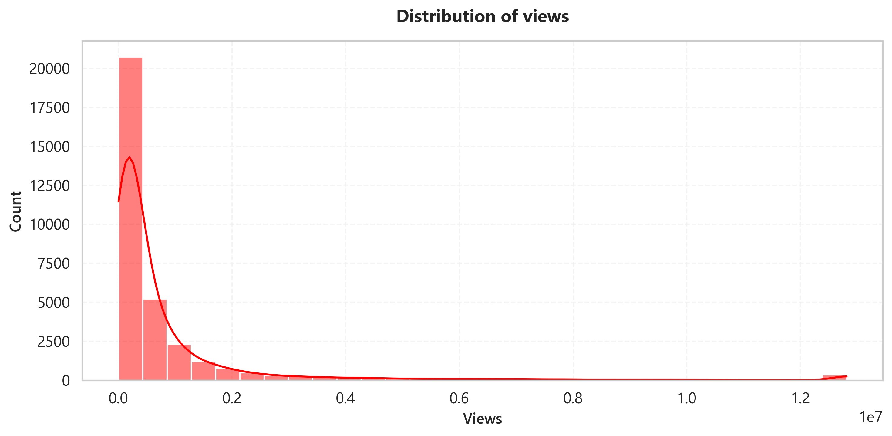
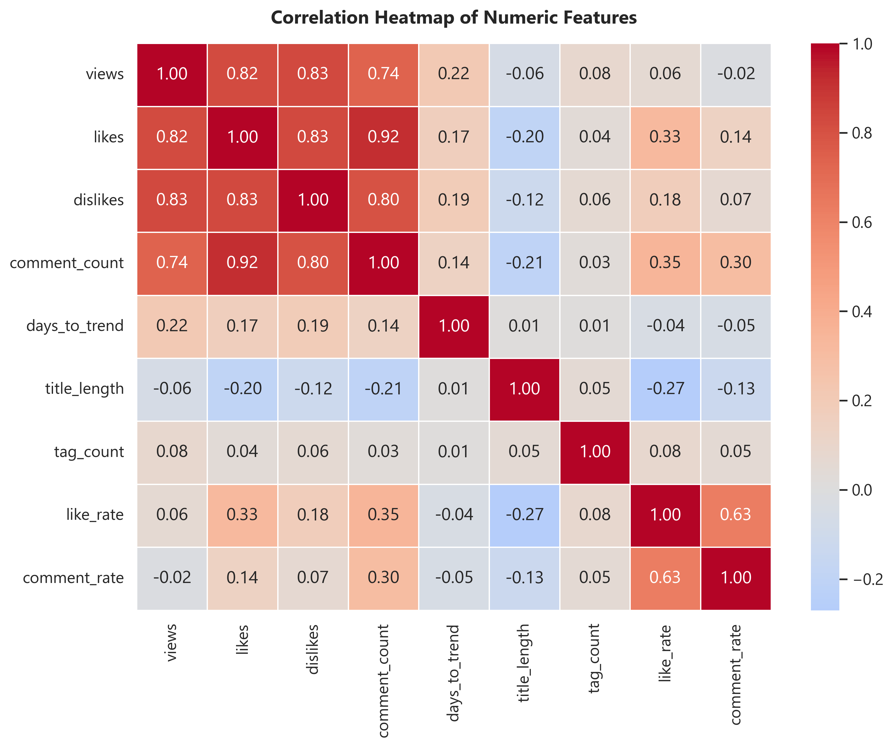

# 📈 YouTube India Trend Analysis & Exploratory Data Analysis (EDA)

An end-to-end Data Analytics project examining trending YouTube videos in India to uncover key drivers behind video popularity, engagement rates, trending speed, and category performance.

---

## 📁 Repository Structure

```text
YOUTUBE_TREND_ANALYSIS/
├── data/
│   └── youtube_india_cleaned.csv         # Cleaned & Processed Dataset
├── notebooks/
│   └── youtube_trend_analysis.ipynb      # Comprehensive Jupyter Analysis Notebook
├── images/                               # Generated EDA Figures & Charts (17 Plots)
│   ├── 07_06_trend_speed_band_distribution.png
│   ├── 08_04_likes_by_views_quartile.png
│   ├── 08_05_views_by_weekday.png
│   ├── 09_01_correlation_heatmap.png
│   ├── 09_02_pivot_heatmap.png
│   ├── 09_03_pairplot.png
│   ├── comment_count_distribution.png
│   ├── comments_status_distribution.png
│   ├── days_to_trend_distribution.png
│   ├── like_rate_distribution.png
│   ├── likes_distribution.png
│   ├── publish_weekday_distribution.png
│   ├── ratings_status_distribution.png
│   ├── tag_use_level_distribution.png
│   ├── views_by_trend_speed.png
│   └── views_distribution.png
├── README.md                             # Project Documentation
└── requirements.txt                      # Python Dependencies
```

---

## 🚀 Key Insights & Features

- **Univariate Analysis**: Distribution of views, likes, comment counts, and trending velocity.
- **Bivariate & Multivariate EDA**: Correlation heatmaps, pairplots, and engagement rate comparisons across weekdays.
- **Feature Engineering**: Tags usage density, publish weekday categorization, and trend speed bands (Fast, Moderate, Slow).

---

## 🛠️ Installation & Setup

1. **Clone the repository**:
   ```bash
   git clone https://github.com/your-username/YOUTUBE_TREND_ANALYSIS.git
   cd YOUTUBE_TREND_ANALYSIS
   ```

2. **Install dependencies**:
   ```bash
   pip install -r requirements.txt
   ```

3. **Launch the Notebook**:
   ```bash
   jupyter notebook notebooks/youtube_trend_analysis.ipynb
   ```

---

## 📊 Sample Visualizations

| Views Distribution | Correlation Heatmap |
|---|---|
|  |  |
