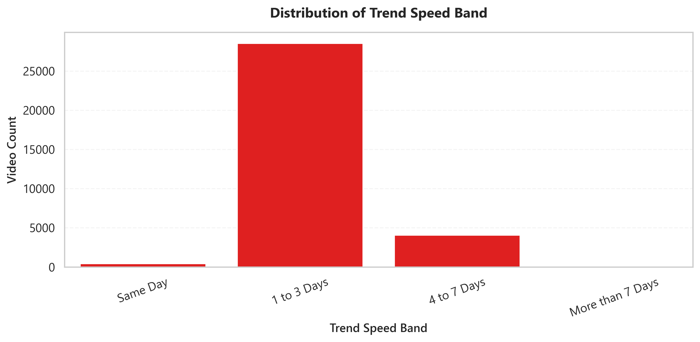
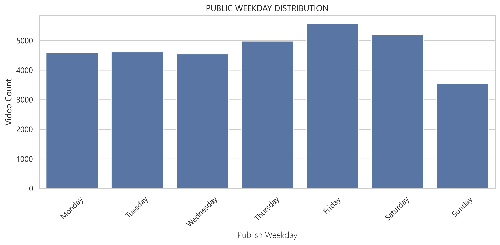
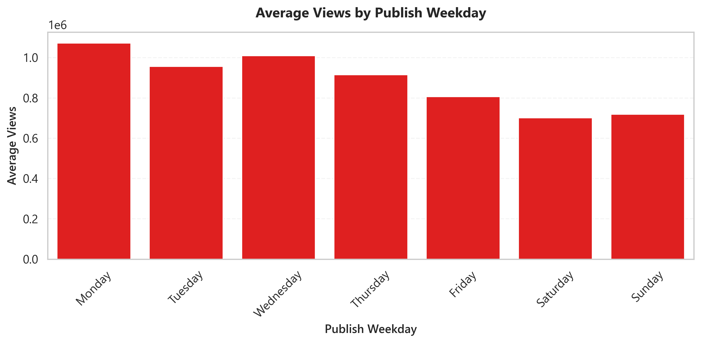
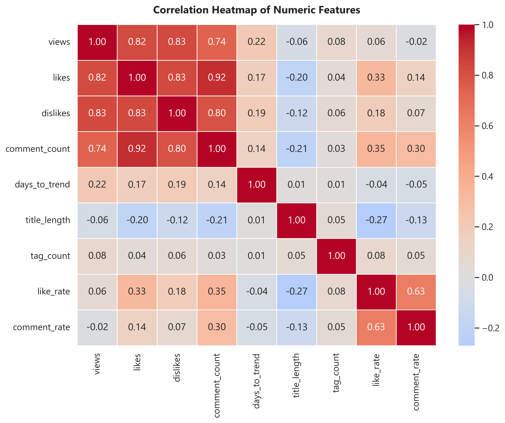
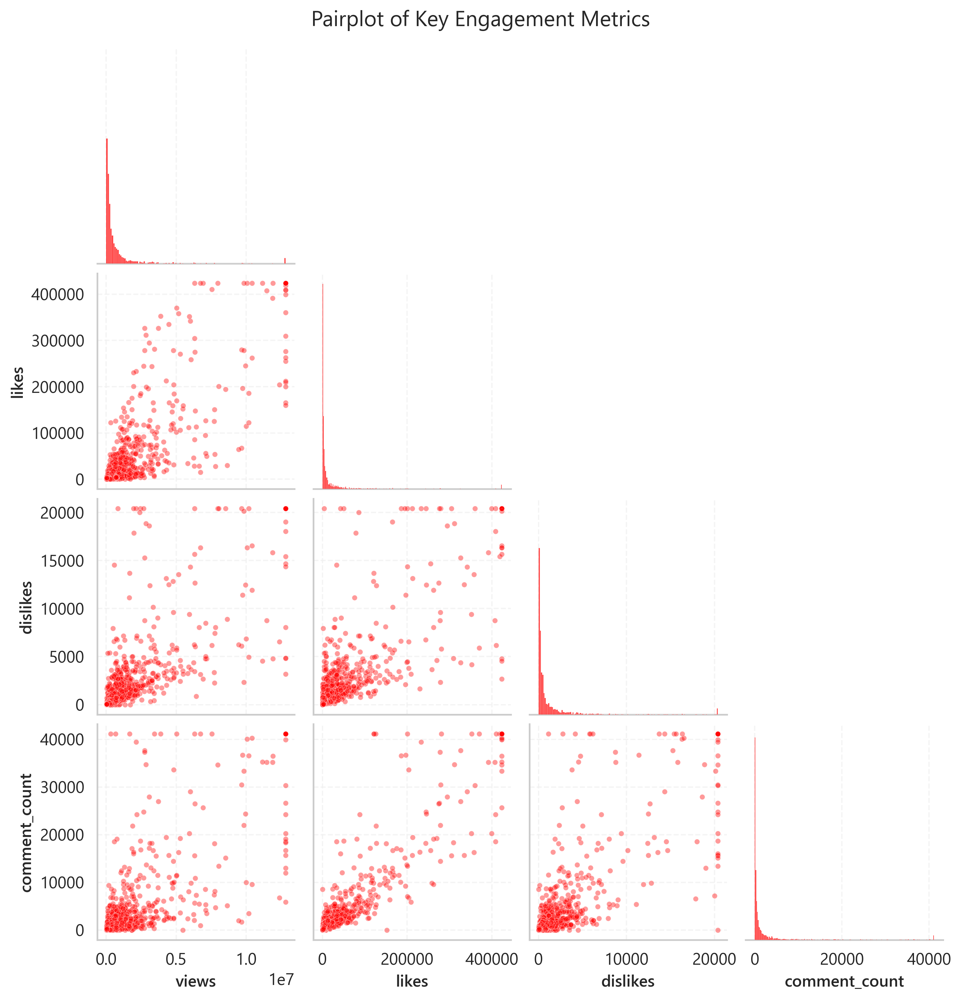

# YouTube India Trending Videos — Exploratory Data Analysis (EDA)

An end-to-end Data Analytics project examining 33,089 trending YouTube videos in India to identify what drives virality, how quickly videos hit trending, the best days to publish, and how engagement metrics scale with reach.

---

## 1. Project Overview

YouTube's trending tab represents the small fraction of videos that capture massive audience attention in a specific market. In this project, I analyzed the Kaggle YouTube India dataset to look at the mechanics behind trending videos — analyzing upload timing, trending speed, engagement rates (likes, comments, views), and metadata practices like tag density.

The goal was to move past subjective opinions and provide concrete, data-backed insights for digital creators, media channels, and brand marketing teams looking to optimize their publishing strategy.

---

## 2. Key Questions This Project Answers

- **How fast do videos trend?** What is the critical window after upload where a video has a chance of trending?
- **Which days are best for publishing?** Do specific weekdays produce more trending videos and higher average views?
- **How does engagement scale with views?** How strongly do likes and comments correlate with total view count?
- **Does metadata (tags and descriptions) matter?** Do trending videos use heavy tags, and does having a description impact performance?
- **What distinguishes top-tier viral videos?** How do Q4 (top quartile) videos differ from average trending uploads?

---

## 3. Dataset Summary

The raw dataset contained 37,352 records. After cleaning and removing 4,263 duplicate entries, the final working dataset contains **33,089 unique trending records** across 29 features (14 original attributes + 15 engineered variables).

| Column | Type | Description |
|---|---|---|
| `video_id` | Text | Unique video identifier |
| `trending_date` | Datetime | Date the video appeared on the trending page |
| `title` | Text | Video title |
| `channel_title` | Text | Name of the YouTube channel |
| `category_id` | Integer | Numeric identifier for video category |
| `publish_time` | Datetime | Exact UTC timestamp of video upload |
| `tags` | Text | Pipe-separated tags used by the creator |
| `views` | Numeric | View count (capped at 99th percentile: 1.28 Crore) |
| `likes` | Numeric | Like count |
| `dislikes` | Numeric | Dislike count |
| `comment_count` | Numeric | Total comments |
| `days_to_trend` | Integer | Days between publish date and trending date *(Engineered)* |
| `trend_speed_band` | Categorical | Speed tier: `Same Day`, `1 to 3 Days`, `4 to 7 Days`, `More than 7 Days` *(Engineered)* |
| `publish_weekday` | Categorical | Day of the week the video was published *(Engineered)* |
| `views_quartile` | Categorical | `Q1`, `Q2`, `Q3`, `Q4` view performance tiers *(Engineered)* |
| `tag_use_level` | Categorical | Tag count tier: `No Tags`, `Low`, `Medium`, `High Tag use` *(Engineered)* |
| `like_rate` | Float | Likes divided by views ratio *(Engineered)* |
| `comment_rate` | Float | Comments divided by views ratio *(Engineered)* |
| `has_description` | Binary | `1` if description exists, `0` if empty *(Engineered)* |

**Data Source:** [Kaggle — YouTube Trending Video Dataset](https://www.kaggle.com/datasets/datasnaek/youtube-new)

---

## 4. What Was Done in This Project

1. **Data Cleaning & Deduplication:**
   - Identified and removed **4,263 exact duplicate rows**, reducing the dataset from 37,352 to 33,089 verified records.
   - Parsed date columns: Converted `trending_date` and `publish_time` into proper `datetime64` types.
   - Handled missing values: 561 videos lacked descriptions; imputed missing text and created a binary `has_description` indicator.
2. **Outlier Treatment:**
   - Engagement metrics (views, likes, comments) exhibit extreme positive skew due to viral outliers.
   - Capped extreme values at the **99th percentile** using `np.percentile()` and `.clip()` to prevent extreme mega-hits from distorting baseline statistics.
3. **Feature Engineering:**
   - Derived `days_to_trend` by subtracting upload date from trending date.
   - Created `trend_speed_band` (`Same Day`, `1 to 3 Days`, `4 to 7 Days`, `More than 7 Days`) using `pd.cut()`.
   - Created `views_quartile` (`Q1` through `Q4`) using `pd.qcut()` to segment performance levels.
   - Categorized `tag_use_level` based on tag count (`No Tags`, `Low`, `Medium`, `High`).
   - Calculated engagement intensity: `like_rate` (likes/views) and `comment_rate` (comments/views).
4. **Univariate Analysis:**
   - Evaluated distributions of views, likes, comments, days to trend, publish weekdays, and tag density.
5. **Bivariate Analysis:**
   - Compared views by publish weekday, likes across views quartiles, and views across trending speed tiers.
6. **Multivariate & Correlation Analysis:**
   - Generated correlation heatmap across numeric engagement variables.
   - Built a two-dimensional pivot heatmap comparing average views across tag density and trending speed.
   - Produced multi-metric pairplots to observe linear relationships.

---

## 5. Key Insights & Visual Findings

### 1. The 72-Hour Golden Window: Over 86% of Videos Trend Within 3 Days
- **86.2% of videos (28,515 records)** hit the trending page within **1 to 3 days** of being published.
- Only **1.3%** of videos trend on the same day as upload, and only **0.2%** take longer than 7 days.
- **Key Takeaway:** YouTube's trending algorithm in India heavily favors early velocity. If a video does not gain rapid traction within the first 48 to 72 hours, its probability of ever trending drops to near zero.



---

### 2. Best Days to Publish: Thursday to Saturday Spike
- **Friday** is the #1 day for trending uploads (**5,573 videos**), followed closely by **Saturday** (**5,196**) and **Thursday** (**4,986**).
- **Sunday** produces the fewest trending videos (**3,558**).
- Thursday and Friday uploads also generate higher average views, aligning with end-of-week and weekend leisure viewing habits in India.





---

### 3. Highly Skewed View Counts (Median vs. Mean)
- The median view count for a trending video is **2.75 Lakhs (275,027)**, while the mean is **8.83 Lakhs**.
- The large gap between median and mean highlights that a small percentage of viral breakout hits pull up the overall average.
- Top quartile (**Q4**) videos average over **2.8M views**, capturing the majority of total platform engagement.


---

### 4. Correlation Analysis: Likes and Comments Strongly Scale Together
- **Likes and Views (r = 0.82):** Strong linear link — higher view count directly translates to higher likes.
- **Likes and Comments (r = 0.92):** The strongest correlation in the entire dataset.
- **Key Takeaway:** Audiences who take the time to comment are almost always active likers. Driving community discussion and comment activity directly boosts overall positive engagement signals.



---

### 5. Multi-Metric Pairplot Relationships
- Pairwise comparisons show consistent positive exponential trends between views, likes, and comment counts.
- Videos that cross into the top tier of views show a sharp upward inflection in comment volume.



---

### 6. Tag Density: Over 91% of Trending Videos Use Medium to Heavy Tags
- **63.8% of trending videos (21,120)** use **High Tag counts** (more than 20 tags).
- **28.0% (9,252)** use **Medium Tag counts** (10 to 20 tags).
- Less than **8.2%** of trending videos had low or no tags.
- **Key Takeaway:** While YouTube's algorithm relies on watch time, keyword metadata and comprehensive tagging remain a staple across nearly all trending content in India.

---

## 6. Project Takeaways at a Glance

When discussing or reviewing this project, these are the core numbers to remember:

- **Dataset Size:** 33,089 cleaned videos after removing 4,263 duplicates.
- **Trending Velocity:** **86.2% of videos trend within 1 to 3 days** (median: 2 days).
- **Optimal Upload Days:** **Thursday, Friday, and Saturday** represent over 47% of all trending videos and the highest average views.
- **Typical Trending Benchmarks:**
  - Median Views: **2.75 Lakhs** (275,027)
  - Median Likes: **2,757**
  - Median Comments: **298**
- **Engagement Ratios:** Median like-rate is **0.94%** (approx. 1 like per 100 views); median comment-rate is **0.10%** (approx. 1 comment per 1,000 views).
- **Strongest Metric Correlation:** Likes and Comments have an **r = 0.92** correlation.
- **Metadata Rule:** Over **91.8%** of trending videos use Medium to High tag density.

---

## 7. Actionable Recommendations for Creators & Channels

| # | Strategic Recommendation | Target Action | Evidence / Reason | Expected Impact |
|---|---|---|---|---|
| **1** | **Focus on the 72-Hour Push** | Channel community, social sharing, push notifications | 86.2% of trending videos hit the list within 1-3 days. | Maximizes initial momentum during the algorithm's critical evaluation window. |
| **2** | **Schedule Uploads on Thursday or Friday** | Upload calendar planning | Highest trending volume (5.5k on Friday) and higher average views. | Captures prime weekend leisure viewing traffic. |
| **3** | **Actively Drive Comment Prompts** | Pinned comments, video questions | Likes and comments have an r = 0.92 correlation. | Higher comment activity correlates with stronger algorithmic discovery. |
| **4** | **Maintain Comprehensive Tagging** | Video SEO & metadata setup | 91.8% of trending videos use Medium to High tag counts. | Ensures optimal indexing across related video recommendations and search queries. |
| **5** | **Keep Comments and Ratings Enabled** | Video settings | Videos with disabled comments or ratings represent less than 3% of trending content. | Preserves engagement signals needed for trending consideration. |

---

## 8. Repository Structure

```
YOUTUBE_TREND_ANALYSIS/
|-- data/
|   \-- youtube_india_cleaned.csv            # Cleaned & processed dataset (33,089 rows, 29 cols)
|-- images/
|   |-- correlation_heatmap.png              # Correlation heatmap of views, likes, comments
|   |-- days_to_trend_distribution.png       # Histogram of days to trend
|   |-- likes_by_views_quartile.png          # Boxplot of likes across views quartiles
|   |-- pairplot.png                         # Multi-metric pairplot
|   |-- pivot_heatmap.png                    # Pivot heatmap: Views by tags & speed band
|   |-- publish_weekday_distribution.png     # Upload day distribution countplot
|   |-- trend_speed_distribution.png         # Trending velocity speed band distribution
|   |-- views_by_weekday.png                 # Average views by publish day barplot
|   \-- views_distribution.png               # Views distribution histogram
|-- notebooks/
|   \-- youtube_trend_analysis.ipynb         # Complete analysis & visualization notebook
|-- requirements.txt                         # Python dependencies
\-- README.md                                # Project documentation
```

---

## 9. Tools Used

- **Python** (Pandas, NumPy) — Data loading, cleaning, datetime parsing, and feature engineering
- **Matplotlib & Seaborn** — Data visualisations, distribution plots, boxplots, heatmaps, and pairplots
- **Jupyter Notebook** — Interactive exploratory data analysis environment

---

## 10. Author

**Deepanshu Kapri**
